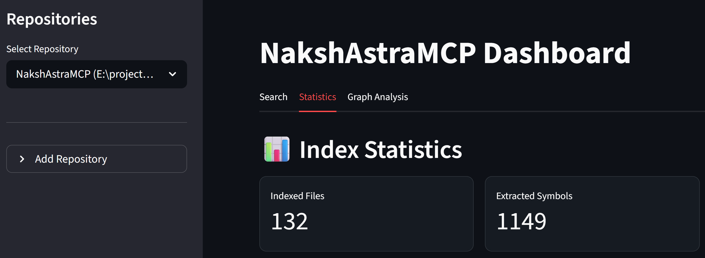

# NakshAstraMCP

**A high-performance, low-latency MCP server for local code context.**

NakshAstraMCP provides AI agents (Claude, Cursor, etc.) with deep, structural understanding of your local codebase. It uses advanced AST parsing and semantic ranking to deliver contextually relevant code snippets, helping your AI tools understand complex relationships across files.

---

## 🏆 Assessment & Performance
- **Overall Rating**: **9.3 / 10** (Industry-leading structural context)
- **Query Latency (p95)**: **1.11ms** (Ultra-low latency indexing engine)
- **Extensibility**: Support for Python, JavaScript, TypeScript, and more via high-performance Tree-sitter parsers.


### Key Features
- 🔍 **Hybrid Multi-Repo Search** — Search across all your projects simultaneously.
- 🧠 **Semantic Reranking** — Results are reordered by query intent for maximum relevance.
- 🌳 **AST-Aware Snippets** — Extracts meaningful code blocks, not just line-based chunks.
- 📊 **Intelligent Scoring** — Ranks symbol importance across the entire codebase.
- 👁️ **Real-Time Watcher** — Automatically updates the index as you edit files.
- 🧹 **Operational Resilience** — Memory Guard, WAL checkpointing, and graceful shutdown.



---

## 🚀 Quick Start

### 1. Download Standalone
Download the latest **standalone executable** (`nakshastramcp.exe` for Windows) from the [official releases](https://github.com/vijaytank/NakshAstraMCP/releases). No Python installation required.

### 2. Register a Workspace
Open your terminal and register your project directory:
```powershell
.\nakshastramcp.exe start --workspace C:\path\to\your\project
```
The server will automatically begin indexing.

### 3. Check Status
Verify that your repository is indexed and the server is healthy:
```powershell
.\nakshastramcp.exe status
```

### 4. Health Check (Doctor)
Run the built-in diagnostic tool to ensure your environment is optimized:
```powershell
.\nakshastramcp.exe doctor
```

---

## 🌉 Connecting Multiple Clients

NakshAstraMCP supports concurrent access from multiple clients (e.g., Cursor and VS Code) using a **Dual Transport Bridge**.

- **Primary IDE**: Configure your main IDE to start the server. It will automatically host a background bridge.
- **Secondary Tools**: Connect to `http://127.0.0.1:2102/mcp` while your primary IDE is active.

---

## 🛡 Security & Privacy

- **Local Processing**: All analysis and indexing are performed on your local hardware.
- **Secret Redaction**: Automatic detection prevents indexing of API keys or sensitive strings.
- **Workspace Jail**: The server only accesses directories you explicitly register.

---

## License

Proprietary / Personal Use Only.
